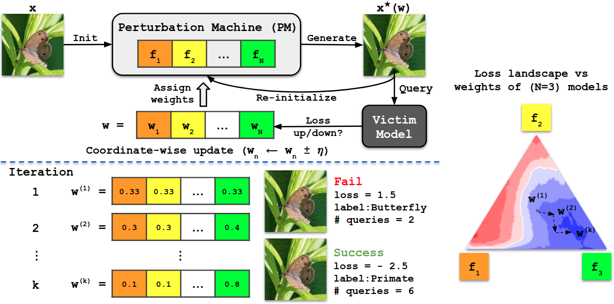

# BASES: Blackbox Attacks via Surrogate Ensemble Search

### [Paper](https://arxiv.org/abs/2208.03610) | [Code](https://github.com/kejsibushi20/AI-Cybersecurity/) | [Slides](https://github.com/kejsibushi20/AI-Cybersecurity/tree/master/Presentation)
Pytorch implementation of *Blackbox Attacks via Surrogate Ensemble Search* in NeurIPS 2022.

[Blackbox Attacks via Surrogate Ensemble Search](https://arxiv.org/abs/2208.03610)  
 [Zikui Cai](https://zikuicai.github.io/), Chengyu Song, Srikanth V. Krishnamurthy, Amit K. Roy-Chowdhury,
 [M. Salman Asif](https://intra.ece.ucr.edu/~sasif/)<br>
 UC Riverside 

In this paper, we propose a novel method for blackbox attacks via surrogate ensemble
search (BASES) that can generate highly successful blackbox attacks using an
extremely small number of queries. We first define a perturbation machine that
generates a perturbed image by minimizing a weighted loss function over a fixed
set of surrogate models. To generate an attack for a given victim model, we search
over the weights in the loss function using queries generated by the perturbation
machine. Since the dimension of the search space is small (same as the number of
surrogate models), the search requires a small number of queries.

<center> 

</center>


## RESULTS - AI& CYBERSECURITY
The scripts we have developed are located in the scripts folder, with their corresponding logs stored in the results folder. Please note that we have included only a subset of the generated adversarial images due to their large file sizes. 

As part of our extended experiments, we analyzed the impact of two key parameters on the performance of our black-box attacks using BASES:

Number of Models in the Ensemble: We investigated how the number of surrogate models in the ensemble affects the attack's success rate and query efficiency. This parameter is crucial as it influences both the diversity of the surrogate models and the computational cost of generating adversarial examples.

Perturbation Bound (ϵ): We also studied how different perturbation bounds, which define the maximum allowable distortion to the input, impact the attack's effectiveness. The perturbation bound plays a key role in ensuring that adversarial examples remain imperceptible while maximizing the success rate of the attack.

Also we fixed some small errors in files like : learn_w_wb.py and get_direct_transfer_rate. 

To see how white box attack works we also did some experiments where we changed the parameter eps in order to see the differences.


## Perform attacks

### Classifiers

```
# Query in a blackbox setting
python query_w_bb.py --n_wb 20 --victim densenet121

# Learn weights in a whitebox setting
python learn_w_wb.py


